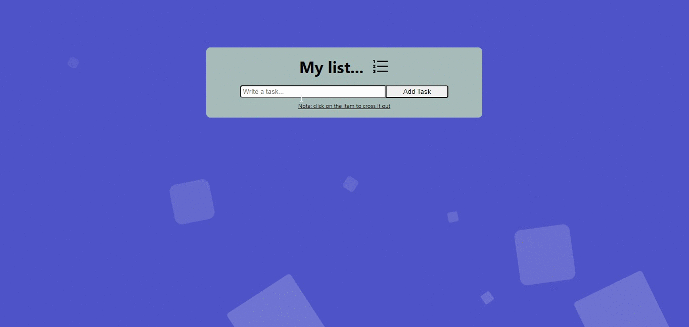

# My list with React
A practical and fun list that will allow you to record what you want so you don't forget it!

## Content
In this responsive project you will find a tool that will allow you to record useful information, such as tasks, purchases, activities, etc... in an easy and fun way, you can also cross it out if you have already completed it or even delete it! For its development, React was used, which with the implementation of some components and the use of Hooks, the result was a friendly, but powerful interface.

### Install
Write **npm i** to your console so you can run the project without problems

### Built with

- React (Javascript, CSS, HTML)

### Page link

<https://elkin-torres.github.io/My-list-with-React/>